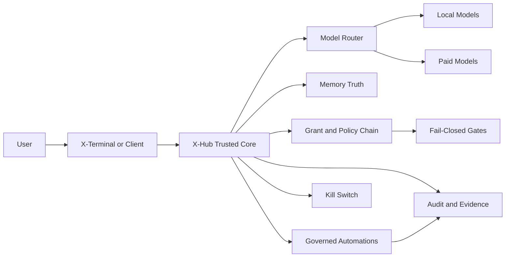

# X-Hub

<p>
  
  
  
  
  
  
  
</p>

> A system architecture for running Agents safely.
>
> X-Hub keeps model routing, memory truth, constitutional constraints, grants, policy, audit, and execution safety inside one governed Hub, while terminals stay lightweight and untrusted by default.

**X-Hub is not just another AI terminal. It is a security-first architecture for governable Agent execution.**

## Public Preview Status

X-Hub is currently a **public tech preview** of a system architecture for safe, governable Agent execution.

Core Hub and X-Terminal paths already run: Hub-governed local and paid model routing, paired terminal execution, early Supervisor orchestration, Hub-backed memory governance, and honest runtime route visibility in X-Terminal.

But this is still a **test version**, not a polished production release:

- onboarding and product UX are still rough
- some capabilities are incomplete, experimental, or changing quickly
- protocol and runtime details may still move
- release claims remain narrower than the total code already present in this repository

The product surface is still incomplete, but the architecture thesis is already concrete enough to build in public.

## Why Open Early

We are publishing X-Hub before it is fully polished because the core direction is already differentiated:

- a Hub-first trust model instead of terminal-first sprawl
- one governed plane for local models and paid models
- memory-backed constitutional guidance instead of prompt-only safety
- Supervisor-oriented orchestration for complex, multi-project execution
- honest runtime visibility, including downgrade and fallback truth, instead of silent masking

If that direction matters to you, we want outside review, technical criticism, and code contributions now, while the system is still taking shape.

## Why This Exists

Most AI apps stop at answering.

X-Hub is built for the harder problem: making AI execution governable.

- One Hub governs local models and paid models through the same control plane.
- Terminals do not own trust, keys, grants, or final policy decisions.
- High-risk paths fail closed when pairing, grants, bridge heartbeat, or runtime readiness is incomplete.
- Memory, automation, and audit stay anchored to the Hub instead of being scattered across clients and plugins.

## Why Not Just Another AI Terminal?

| Typical AI client | X-Hub |
|---|---|
| Trust is spread across desktop apps, plugins, and scripts | Trust is centralized in the Hub |
| Local model path and paid model path drift apart | Local and paid models are governed together |
| Automation is best-effort | Automation is Hub-first and policy-gated |
| Terminals accumulate memory and secrets | Terminals stay lightweight and untrusted by default |
| Missing readiness often degrades silently | Missing readiness fails closed and surfaces a reason |

## Validated Release Scope

This GitHub package is intentionally narrow.

The validated public mainline is limited to:

- `XT-W3-23 -> XT-W3-24 -> XT-W3-25`

Validated external claims for this package are limited to:

- `XT memory UX adapter backed by Hub truth-source`
- `Hub-governed multi-channel gateway`
- `Hub-first governed automations`

Hard release rules for this public package:

- `no_scope_expansion=true`
- `no_unverified_claims=true`
- `allowlist-first=true`
- `fail_closed_by_default=true`

## What Already Works In This Preview

The current repository and preview builds already demonstrate working foundations for:

- X-Hub macOS app build and runtime
- X-Terminal source build and packaged app flow
- paired Hub <-> Terminal routing across local and remote paths
- Hub-governed local and paid model execution
- truthful configured-model vs actual-model visibility in X-Terminal
- early Supervisor and project-coder orchestration surfaces
- Hub-backed memory, policy, and audit integration as the system-of-record direction

Treat these as active preview surfaces, not as a promise that every edge case or surrounding UX is already finished.

## Why This Is More Than A Demo

Even in preview form, the system direction is already broader than a thin chat wrapper:

- **Supervisor as an execution layer**: the architecture is built toward multi-project supervision, module-aware decomposition, pool and lane scheduling, directed unblocks, and governed delivery progression.
- **X-Constitution as a behavioral genome**: the goal is to write durable value constraints into the system's behavioral DNA, anchored to Hub memory and reinforced by policy, grants, audit, and kill-switches instead of disappearing into ad hoc prompts.
- **High-risk workflows with explicit evidence**: the same control-plane model can support evidence-first approvals, governed payment-style flows, and future multi-party approval patterns for irreversible actions.
- **Voice as an operational interface, not just dictation**: the broader design direction includes wake, guided authorization, and progress conversations with Supervisor over auditable runtime state.
- **Honest runtime truth**: configured route, actual route, downgrade, fallback, and readiness state are intended to stay visible instead of being silently masked from the operator.

These points describe the architecture-backed direction of the system. The validated public release claims remain narrower and are intentionally bounded above.

## Why Teams Would Want It

- **Hub-first trust model**: pairing, grants, policies, and audit live in one place.
- **Unified model governance**: local inference and paid APIs use the same operational guardrails.
- **Execution safety**: high-risk actions do not proceed on incomplete evidence.
- **Long-horizon stability**: Hub-backed memory reduces drift across multi-step work.
- **Multi-terminal design**: terminals can stay fast and replaceable without becoming the trust anchor.

## Who Should Use X-Hub First

X-Hub is especially suited for:

- **Enterprises** that want centralized trust, audit, and model-governance controls.
- **Public-sector teams** and other high-security environments that need stronger operational boundaries.
- **Regulated or security-sensitive organizations** that cannot rely on best-effort client behavior.

It is also a strong fit for **individual users** who want a safer AI setup, clearer readiness checks, and tighter control over model access and automation.

The key point is not organization size. The key point is whether you want a stronger safety posture than a terminal-only AI app can usually provide.

## Recommended X-Hub Host Hardware

Yes: for recommended X-Hub host hardware, **Mac mini** and **Mac Studio** are the right classes of machine to recommend.

Why:

- X-Hub currently ships a native macOS Hub app and runtime surface.
- The active Hub app package targets `macOS 13+`.
- The Hub runtime also includes an MLX-based local runtime path, which aligns naturally with Apple silicon desktops.

Recommended deployment tiers:

- **Mac mini** for most individual users, pilots, small teams, and lighter Hub deployments
  - best when X-Hub is primarily acting as the trusted control plane, with moderate local runtime load
  - a strong default if you want a compact, lower-cost dedicated Hub machine
- **Mac Studio** for heavier local-model workloads, higher concurrency, larger memory needs, or more demanding always-on deployments
  - better fit when the Hub is expected to carry more local inference work in addition to control-plane duties
  - especially suitable for enterprise, public-sector, and other high-security environments that want a dedicated and more capable desktop host

Practical recommendation:

- If the main value is **pairing, grants, routing, audit, and safer automation**, start with **Mac mini**.
- If the main value also includes **heavier local models, larger memory headroom, or more parallel load**, step up to **Mac Studio**.

For public positioning, the clean wording is:

> X-Hub is recommended to run on Apple silicon desktop Macs, with Mac mini as the default recommendation and Mac Studio as the higher-capacity recommendation.

## What Is Shipping Now

Within the validated mainline above, this repository already demonstrates:

1. **Hub-backed memory UX**
   X-Terminal can present memory-aware UX while the Hub remains the truth-source.
2. **Governed multi-channel gateway**
   Channel routing stays inside Hub policy instead of leaking across clients.
3. **Hub-first automations**
   Automation flows are routed through Hub readiness, policy, and audit constraints.

Everything else in this repository should be read as implementation context, roadmap, or internal delivery material unless it is explicitly part of the validated scope above.

## Supervisor Orchestration Core

X-Hub is not only a route-and-policy layer.

The paired X-Terminal Supervisor is designed as an execution orchestrator for complex work, especially when one chat window is not enough to manage delivery safely.

In the broader system architecture, that means:

- intake can turn project specs into an executable manifest
- complex engineering work can be decomposed into module-aware pools and then into parallel lanes
- multiple active projects can be supervised under one scheduling surface instead of being managed as isolated chats
- lane assignment can consider priority, risk, load, budget, skill fit, and reliability fit
- blocked work can be governed through wait-for graphs, dual-green dependency gates, directed unblocks, congestion control, and dynamic replanning

This section describes the execution architecture and internal orchestration core.

It does **not** expand the validated public release slice above.

## Architecture In 30 Seconds



Execution baseline:

`pair -> resolve route -> check policy -> verify readiness -> execute -> audit`

## Memory-Backed Constitutional Guardrails

X-Hub does not treat safety as prompt text alone.

The broader system design includes an **X-Constitution** layer that is anchored to the Hub-side memory system and used to stabilize agent behavior around risk, privacy, authorization, audit integrity, and side effects.

Its purpose is not to make the model "sound safer." Its purpose is to write human value boundaries into the behavioral genome of a governable AGI system, so those boundaries remain higher-order than any single task objective.

In practice, that means:

- a pinned constitutional layer can live with Hub memory rather than only inside terminal-local prompts
- compact L0 constitutional constraints can be injected when relevant
- longer L1 guidance can support review, explanation, and audit
- hard enforcement still belongs to the Hub policy engine, grants, manifests, audit, and kill-switches

What this is designed to resist:

- a malicious page or hidden prompt-injection payload should not be able to trick the system into leaking local secrets or keys just because the agent read the page
- destructive actions such as deleting mail, wiping files, or modifying production data should not proceed on vague intent, missing scope, or ambiguous authorization
- third-party skills should not be able to steal keys, plant backdoors, or inherit high privilege by default just because they were imported
- implementation vulnerabilities may still exist, but compromise impact should be constrained by Hub-first trust, least privilege, audit, and fail-closed behavior instead of turning one bug into full-system loss

This matters because it reduces behavioral drift and makes safety posture less dependent on whichever terminal or prompt surface happened to be used.

Key references:

- `X_MEMORY.md`
- `docs/xhub-constitution-l0-injection-v1.md`
- `docs/xhub-constitution-l1-guidance-v1.md`
- `docs/xhub-constitution-policy-engine-checklist-v1.md`

## Broader Workflow Fit

The architecture is intended for workflows where a terminal-only AI setup is too weak.

Examples include:

- multi-project engineering programs that need supervised intake, structured decomposition, parallel lanes, and controlled mergeback
- governed external side effects that must remain auditable and fail closed instead of silently degrading
- evidence-first payment approval flows with challenge, confirmation, timeout rollback, anti-replay protection, and audit

These examples describe the broader operating model and protocol surface.

They should not be read as additional validated public release claims for this GitHub package.

For a structured explanation of validated scope, broader workflow fit, and future roadmap scenarios, see `docs/xhub-scenario-map-v1.md`.

## Core Product Advantages

### 1. Trusted Hub, Untrusted Terminals

The terminal is not the trust anchor.

That separation matters because it lets you improve UX, swap clients, and run richer session surfaces without moving grants, secrets, or policy enforcement out of the Hub.

### 2. One Governed Plane For Local + Paid Models

Most systems bolt paid APIs onto a separate path.

X-Hub treats local models and paid models as operational peers under the same governance surface: routing, readiness, grants, and audit.

### 3. Fail-Closed Instead Of Pretend-Recovery

If pairing is incomplete, model inventory is stale, bridge heartbeat is missing, or runtime verification is blocked, X-Hub surfaces that state directly instead of pretending the system is safe to continue.

### 4. Memory Stays Attached To The System Of Record

The memory story is not "the client remembers more."

The memory story is that the Hub remains the durable truth-source and terminals consume that truth through governed surfaces.

### 5. Safety Is Backed By Memory And Policy, Not Prompt Tricks Alone

X-Hub uses constitutional guidance as part of a broader Hub-side control system.

The goal is to keep behavior bounded by persistent memory-backed rules and then reinforce those rules with policy-engine enforcement, grant checks, audit, and fail-closed execution.

## Quick Start

### Build The Hub App

```bash
x-hub/tools/build_hub_app.command
```

### Build The X-Terminal App

```bash
bash x-terminal/tools/build_xterminal_app.command
```

### Run X-Hub From Source

```bash
cd x-hub/macos/RELFlowHub
swift run RELFlowHub
```

### Run X-Terminal From Source

```bash
cd x-terminal
swift run XTerminal
```

### Run The XT Release Gate

```bash
bash x-terminal/scripts/ci/xt_release_gate.sh
```

If you want the stricter gate mode:

```bash
cd x-terminal
XT_GATE_MODE=strict bash scripts/ci/xt_release_gate.sh
```

## Build With Us

X-Hub is being opened early on purpose.

We are especially interested in contributors who care about:

- Swift/macOS productization for Hub and Terminal
- Hub routing, provider compatibility, and remote runtime reliability
- Supervisor orchestration, multi-project execution, and governed automation
- voice loop, diagnostics, and operator UX
- protocol design, tests, release engineering, and security review

If you want to help shape a Hub-first AI system instead of another thin terminal wrapper, start with `CONTRIBUTING.md` and open an issue or pull request.

## 30-Second Demo Flow

If you want the shortest end-to-end story:

1. Launch `X-Hub`
2. Launch `X-Terminal`
3. Pair the terminal to the Hub
4. Confirm model route readiness
5. Confirm bridge and tool readiness
6. Run one simple model call
7. Verify that policy, routing, and runtime status remain visible from the Hub-governed flow

## Manual Demo Flow

Use this order for a quick system check:

1. Launch `X-Hub`
2. Confirm pairing and RPC ports are ready in Hub settings
3. Launch `X-Terminal`
4. Pair X-Terminal to the Hub
5. Verify model route readiness
6. Verify bridge and tool readiness
7. Verify session runtime readiness
8. Run a simple model call

## Repository Layout

| Path | Purpose |
|---|---|
| `x-hub/` | Active Hub app, gRPC server, model routing, grants, and trust surfaces |
| `x-terminal/` | Active terminal implementation, supervisor flows, session runtime, and doctor checks |
| `protocol/` | Shared contracts between Hub and terminal surfaces |
| `specs/` | Active spec packs and traceability artifacts |
| `docs/` | Specs, release docs, security guidance, and work orders |
| `scripts/` | Repo-level validation, export, and packaging scripts |
| `archive/` | Archived history only, not part of the active runtime surface |

Detailed layout:

- `docs/REPO_LAYOUT.md`
- `x-hub/README.md`
- `x-terminal/README.md`
- `protocol/README.md`
- `scripts/README.md`
- `specs/README.md`

## Security Model

- Terminal compromise should not automatically compromise Hub policy decisions.
- No valid grant means no high-risk execution.
- No readiness means no pretend-recovery.
- Constitutional guidance is meant to be pinned on the Hub side and reinforced by policy-engine enforcement, not left as terminal-only prompt text.
- Audit and evidence are first-class runtime outputs, not afterthoughts.
- Emergency controls stay available through Hub-side governance.

## FAQ

### Is X-Hub only for enterprises?

No.

It is especially well suited to enterprises, public-sector teams, and other environments with stricter security or governance requirements, but individuals can also benefit if they want a safer and more controlled setup.

### Is this production-ready?

Not yet.

This GitHub repository should currently be read as an early public preview and test release. Core runtime flows are already meaningful and increasingly usable, but onboarding, product completeness, operational polish, and some capability surfaces are still in progress.

### Why is X-Hub safer than a terminal-only AI setup?

Because trust does not live in the terminal alone.

X-Hub centralizes grants, route control, readiness checks, audit, and policy enforcement in the Hub, and it fails closed when critical conditions are incomplete.

### Is the safety model just prompt engineering?

No.

The repository also defines an X-Constitution layer tied to Hub memory and Hub policy enforcement. The intent is to keep behavior bounded by persistent constitutional guidance and then back that guidance with enforceable controls such as grants, manifests, audit, and kill-switches.

### Does this repository claim every advanced capability shown in internal docs?

No.

Public claims for this package are intentionally limited to the validated release slice described above.

### What should I read first?

Use this order:

1. `README.md`
2. `docs/whitepaper-submodule.md`
3. `docs/REPO_LAYOUT.md`
4. `x-hub/README.md`
5. `x-terminal/README.md`
6. `docs/WORKING_INDEX.md`

## Documentation Map

Start here:

1. `docs/REPO_LAYOUT.md`
2. `X_MEMORY.md`
3. `docs/WORKING_INDEX.md`
4. `x-hub/README.md`
5. `x-terminal/README.md`

Release and governance references:

- `RELEASE.md`
- `CHANGELOG.md`
- `docs/whitepaper-submodule.md`
- `docs/open-source/OSS_RELEASE_CHECKLIST_v1.md`
- `docs/open-source/GITHUB_RELEASE_NOTES_TEMPLATE_v1.md`

## Release Discipline

This repository contains more implementation material than the currently validated public release slice.

Public statements for this package must stay inside the validated mainline only. If a capability is not explicitly covered by that scope, treat it as not release-claimed.

## License

MIT. See `LICENSE`.
