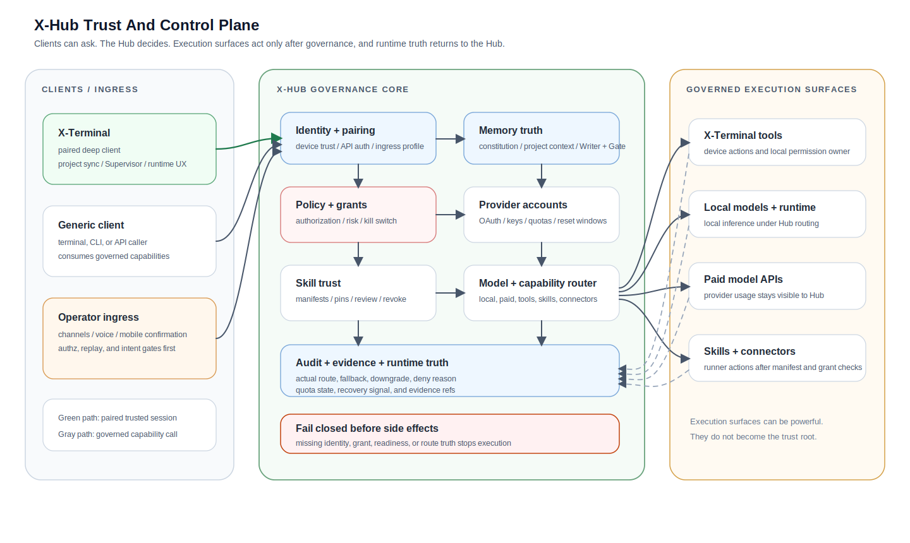

# X-Hub-System

<p>
  
  
  
  
  
</p>

> **A self-hosted Hub between you and Claude, GPT, or local models.**
> You see what actually ran, you catch the bad calls before they land, and your memory and audit travel with you when you switch providers.

[Website](https://xhubsystem.com) · [中文 README](README_zh.md) · [Capability matrix](docs/open-source/XHUB_CAPABILITY_MATRIX_v1.md) · [CHANGELOG](CHANGELOG.md) · [Releases](https://github.com/AndrewXie-Rich/x-hub-system/releases)

## Who it's for

- **Developers** who want to see and audit what actually ran — route truth, fallback, downgrade, signed receipts included → keep reading
- **Families** that want shared AI with parent-controlled limits and per-action confirmation → see [FAMILY.md](FAMILY.md)
- **Teams and enterprises** that can't ship code, prompts, or memory through SaaS-only AI tools → see [ENTERPRISE.md](ENTERPRISE.md)

## The boundary in one diagram



The terminal is not the trust root. Model routing, memory truth, grants, audit, skill trust, and execution readiness are governed from the Hub. Terminals and other clients are replaceable governed surfaces.

## What's working today

Each bullet maps to a `validated` or `preview-working` row in the [capability matrix](docs/open-source/XHUB_CAPABILITY_MATRIX_v1.md):

- Hub-first trust anchor with fail-closed defaults on pairing, grants, readiness, and policy gates
- One control plane routing both local models (Transformers / MLX) and paid providers (Claude / GPT / others)
- Hub-backed memory UX with `Writer + Gate` as the only durable-write boundary
- Governed skills catalog with publisher trust roots, pin / grant / revoke, and preflight gating
- Project governance with separate `A-Tier` (execution authority), `S-Tier` (supervision depth), and `Heartbeat / Review` (cadence) controls
- Hub-governed multi-channel ingress (Slack / Telegram / Feishu / voice / mobile-confirmation) with replay guard and grant gating
- Honest runtime visibility — configured vs actual model, fallback, downgrade, blocked reason, and recovery evidence all surfaced
- Signed Hub Receipts on every authorized action — verifiable outside X-Hub, embeddable in commits

Anything not in the matrix as `validated` or `preview-working` should be read as implementation-in-progress or direction-only.

## How to run it

**macOS, today.** Apple Silicon. Combined DMG with `X-Hub.app` + `X-Terminal.app`.

```bash
git clone https://github.com/AndrewXie-Rich/x-hub-system.git
cd x-hub-system && ./x-hub/tools/build_hub_app.command
open build/X-Hub.app   # pair X-Terminal once Hub is up
```

**Linux daemon, in flight.** `docker-compose up` deployment, 90-day P0. Track [Status & Roadmap](docs/open-source/XHUB_CAPABILITY_MATRIX_v1.md) for the cutover.

**Spec-only, no X-Hub needed.** If you only want the trust layer above MCP or the per-action confirmation primitive, take just the spec:

- [mcp-trust-registry](specs/mcp-trust-registry/)
- [agent-2fa](specs/agent-2fa/)
- [hub-receipt](specs/hub-receipt/)

X-Hub is one implementation of these; you can write your own.

Source-run, Rust kernel, packaged release details: [`docs/REPO_LAYOUT.md`](docs/REPO_LAYOUT.md), [`RELEASE.md`](RELEASE.md).

## Architecture

Pair → resolve client capability → retrieve governed memory and policy → resolve model and capability route → check grants and readiness → execute through a governed surface → audit and report runtime truth. All authority sits in the Hub; terminals call into it.

Deep dives: [`docs/REPO_LAYOUT.md`](docs/REPO_LAYOUT.md), [`docs/xhub-hub-architecture-tradeoffs-v1.md`](docs/xhub-hub-architecture-tradeoffs-v1.md), [archived long-form README](docs/legacy/README_full_v1.md).

## Specs (extracted)

Two protocol specs (plus a shared envelope) live as standalone repos for community review. X-Hub-System is their reference implementation:

- [**mcp-trust-registry**](specs/mcp-trust-registry/) — A trust layer above MCP. Stops a "patch update" from silently adding `shell:exec` to an MCP server you trusted yesterday. Schemas, examples, CI validation in repo.
- [**agent-2fa**](specs/agent-2fa/) — Per-action 2FA for AI agent actions. Touch ID confirmation on a paired device before a destructive command lands. Spec + 4 JSON Schemas + example chain.
- [**hub-receipt**](specs/hub-receipt/) — Shared signed-receipt envelope used by both. Receipts verifiable outside X-Hub; embeddable in commits, IDE metadata, chat.

## License and commercial

X-Hub-System ships under an **open-core** model:

- **MIT-licensed kernel** — Hub daemon, single-user grants/audit, basic routing, governed skills, local model runtime. Free for personal, family, and open-source use, forever.
- **Commercial license** — multi-user roles, SSO/OIDC, SIEM export, compliance report generators, support SLA, private deployment and integration. See [ENTERPRISE.md](ENTERPRISE.md).
- Pilot inquiry: <contact@xhubsystem.com>

Repository license details: [LICENSE](LICENSE), [LICENSE_POLICY.md](LICENSE_POLICY.md), [TRADEMARKS.md](TRADEMARKS.md). The MIT license does not grant trademark rights.

## Status

Public technical preview. Core paths run. macOS-only today; Linux daemon in flight. Per-surface honest status: **[capability matrix](docs/open-source/XHUB_CAPABILITY_MATRIX_v1.md)**. Release notes must not claim beyond it.

## Community

Issues: <https://github.com/AndrewXie-Rich/x-hub-system/issues> · Security: [SECURITY.md](SECURITY.md) · Governance: [GOVERNANCE.md](GOVERNANCE.md) · Contributing: [CONTRIBUTING.md](CONTRIBUTING.md) · Changelog: [CHANGELOG.md](CHANGELOG.md)
