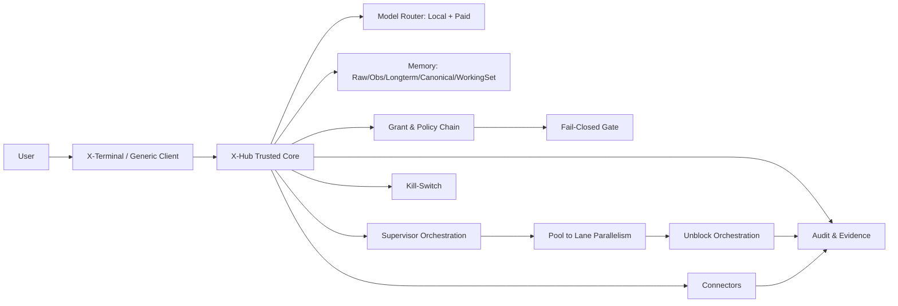

# X-Hub Distributed Secure Interaction System

<p>
  
  
  
  
  
  
  
</p>

> From "can answer" to "can be trusted to execute".
>
> X-Hub centralizes AI routing, memory governance, grants, audit, payment safety, and key controls into one trusted core, while terminals stay lightweight and untrusted by default.

---

<a id="table-of-contents"></a>
## Table of Contents

- [Overview](#overview)
- [Release Scope (R1)](#release-scope-r1)
- [Why X-Hub](#why-x-hub)
- [Core Innovations](#core-innovations)
- [Architecture](#architecture)
- [Security Model](#security-model)
- [Current Delivery Snapshot (2026-03-02)](#current-delivery-snapshot-2026-03-02)
- [Repository Layout](#repository-layout)
- [Quick Start](#quick-start)
- [Documentation Map](#documentation-map)
- [Release and Governance](#release-and-governance)
- [License](#license)

---

<a id="overview"></a>
## Overview

X-Hub is a distributed secure interaction system composed of **X-Hub + X-Terminal**:

- **Trusted Hub Core**: AI model routing (local + paid), memory, grants, audit, connectors, and emergency controls.
- **Untrusted-by-default Terminals**: rich interaction experience without owning core trust decisions.
- **Execution-first design**: every high-risk action must pass explicit policy and evidence gates.

The target is not only better chat quality, but reliable long-horizon execution with traceability.

---


<a id="release-scope-r1"></a>
## Release Scope (R1)

This public packaging slice is limited to the validated mainline only: `XT-W3-23 -> XT-W3-24 -> XT-W3-25`.

Validated external statements for this package are limited to:
- `XT memory UX adapter backed by Hub truth-source`
- `Hub-governed multi-channel gateway`
- `Hub-first governed automations`

Hard lines for this GitHub release package:
- `no_scope_expansion=true`
- `no_unverified_claims=true`
- public packaging remains `allowlist-first + fail-closed`
- `build/**`, `data/**`, `*.sqlite*`, `*kek*.json`, and similar restricted artifacts stay outside the public package

<a id="why-x-hub"></a>
## Why X-Hub

- **Trusted execution over chat-only UX**: signed manifests + grants + cross-terminal checks for high-risk actions.
- **Unified model governance**: local and paid models share the same grant/quota/audit control plane.
- **Long-run stability**: five-layer memory architecture prevents context drift in complex projects.
- **Token-efficient collaboration**: stable-core + delta + reference-only context strategy.
- **Operational reliability**: fail-closed by default, machine-readable evidence, rollback-first release discipline.

---

<a id="core-innovations"></a>
## Core Innovations

1. **Multi-pool adaptive orchestration (`pool -> lane`)**
   - Dynamic split by complexity, dependency density, risk tier, and token budget.
2. **Tri-part prompt contract**
   - `Stable Core + Task Delta + Context Refs` for lower token waste and better reproducibility.
3. **Anti-block progression chain**
   - `wait-for graph + dual-green dependency gate + unblock router + SLA escalator`.
4. **Constitutional constraints**
   - X-Constitution pinned rules for value-aligned and policy-safe AI behavior.
5. **Single-file lane governance (Command Board v2)**
   - CR inbox, claim TTL, 7-piece handoff, machine-checkable gate/evidence integrity.
6. **Open ecosystem compatibility**
   - OpenClaw skill ABI compatibility bridge under fail-closed safety boundaries.

---

<a id="architecture"></a>
## Architecture



Execution policy baseline:

`ingress -> risk classify -> policy -> grant -> execute -> audit`

---

<a id="security-model"></a>
## Security Model

- **Terminal is not a trust anchor**: terminal compromise should not compromise Hub policy decisions.
- **High-risk action protocol**: signed `ActionManifest/TxManifest` + SAS cross-terminal verification.
- **Grant enforcement**: no valid grant, no high-risk execution.
- **Require-real discipline**: synthetic/smoke evidence is blocked on release-critical paths.
- **Emergency controls**: global kill-switch, grant revoke, audit-first incident handling.

---

<a id="current-delivery-snapshot-2026-03-02"></a>
## Current Delivery Snapshot (2026-03-02)

For the R1 public package, only the validated mainline declared in [Release Scope (R1)](#release-scope-r1) is release-ready. Remaining items in this snapshot are repository status context and must not be used as expanded public claims for this release.

Status legend: `done` / `in progress` / `roadmap`

- `done` Hub unified session channels (`auto/grpc/file`, gRPC preferred).
- `done` Supervisor heartbeat and queue/grant/next-step summary loop.
- `done` Command Board v2 workflow (`CR + claim TTL + 7-piece handoff`).
- `done` baseline model governance path for local + paid capabilities.
- `in progress` multi-pool adaptive split execution chain.
- `in progress` tri-part prompt compiler and context capsule optimization.
- `in progress` anti-block orchestration (`wait-for/dual-green/unblock/SLA`).
- `in progress` Observations and Longterm memory full implementation.
- `in progress` Connectors closure and pending-grant UX integration.
- `roadmap` encryption scope expansion + cold-token update/rollback hardening.

Source of truth:
- `X_MEMORY.md`
- `docs/WORKING_INDEX.md`
- `docs/memory-new/xhub-memory-v3-execution-plan.md`

---

<a id="repository-layout"></a>
## Repository Layout

| Path | Purpose |
|---|---|
| `x-hub/` | Hub app, gRPC server, python runtime, tools |
| `x-terminal/` | X-Terminal implementation, supervisor, tests, CI scripts |
| `protocol/` | gRPC and IPC contracts |
| `docs/` | executable specs, work orders, memory/security/release docs |
| `scripts/` | gate checks, export tools, validation pipelines |
| `build/` | local outputs and machine-readable reports |

---

<a id="quick-start"></a>
## Quick Start

R1 quick start is scoped to the validated mainline only and to the minimal public package. It does not treat local binary packaging outputs as part of the public GitHub artifact set.

Build the Hub app bundle locally:

```bash
x-hub/tools/build_hub_app.command
```

Run XT release gate checks for the validated mainline:

```bash
bash x-terminal/scripts/ci/xt_release_gate.sh
```

Notes:
- `x-terminal/scripts/ci/xt_release_gate.sh` is the release-facing smoke/gate entrypoint for this package.
- Build outputs such as `build/**`, `*.app`, `*.dmg`, and runtime databases are excluded from the public package.
- Build scripts may run `npm ci` in `x-hub/grpc-server/hub_grpc_server/` if `node_modules/` is missing.
- Set `XHUB_NPM_INSTALL=never` to skip auto-install.

---

<a id="documentation-map"></a>
## Documentation Map

Start here:

1. `X_MEMORY.md`
2. `docs/WORKING_INDEX.md`
3. `docs/memory-new/xhub-lane-command-board-v2.md`
4. `x-terminal/work-orders/xt-supervisor-multipool-adaptive-work-orders-v1.md`
5. `x-terminal/work-orders/xt-supervisor-multipool-lane-execution-pack-v1.md`

Security and policy:

- `docs/memory-new/xhub-hub-to-xterminal-capability-gate-v1.md`
- `docs/xhub-constitution-l0-injection-v1.md`
- `docs/xhub-constitution-l1-guidance-v1.md`
- `docs/xhub-constitution-policy-engine-checklist-v1.md`

Open-source release:

- `docs/open-source/OSS_RELEASE_CHECKLIST_v1.md`
- `CHANGELOG.md`
- `RELEASE.md`

---

<a id="release-and-governance"></a>
## Release and Governance

- Primary principle: **fail closed** when evidence, grants, or gates are insufficient.
- Promotion rule: no `closed` status without gate/evidence integrity.
- Coordinator model: lane ownership + claim TTL + auditable handoff + rollback points.
- Open-source governance: issue templates, PR template, CODEOWNERS, Dependabot.

---

<a id="license"></a>
## License

MIT. See `LICENSE`.
