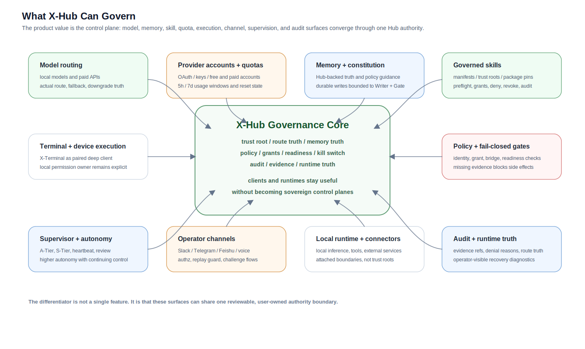

# X-Hub-System

> Active codebase marker: this repository root is the source of truth for the public X-Hub-System codebase. Build the current Hub UI with `./x-hub/tools/build_hub_app.command`; build X-Terminal with `./x-terminal/tools/build_xt_with_rust_sidecar.command`. Generated apps and DMGs live under `build/` and are release artifacts, not Git-tracked source.

<p>
  
  
  
  
  
  
</p>

**X-Hub-System is a Hub-first, user-owned architecture for governable AI Agent execution.**

It is not just another terminal wrapper. The Hub is the trust anchor: model routing, memory truth, policy, grants, audit, skill trust, and execution readiness are governed from X-Hub, while X-Terminal acts as the paired deep client and other clients remain replaceable surfaces.

The repository currently contains:

- `X-Hub`: the macOS Hub app and Node-backed service layer.
- `X-Terminal`: the paired terminal and Supervisor surface.
- `Rust backend work`: an efficiency and reliability rewrite path under guarded authority gates.
- `official-agent-skills`: governed official skill packages, manifests, trust roots, and distribution artifacts.
- `website`: the VitePress public documentation site source.

Repository license note: this repository is released under the **MIT License**. Trademark rights are not granted by the software license; see `TRADEMARKS.md`.

## Status

X-Hub-System is currently a **public tech preview**.

Core paths already run, but this is not a polished production release. Onboarding, packaging, product UX, protocol details, and some capability surfaces are still changing.

Use this status table when reading the repository:

But this is still a **test version**, not a polished production release:

- onboarding and product UX are still rough
- some capabilities are incomplete, experimental, or changing quickly
- protocol and runtime details may still move
- release claims remain narrower than the total code already present in this repository

The product surface is still incomplete, but the architecture thesis is already concrete enough to build in public.

For surface-by-surface state, use `docs/open-source/XHUB_CAPABILITY_MATRIX_v1.md`.
That matrix is the working truth for whether a capability is `validated`, `preview-working`, `protocol-frozen`, `implementation-in-progress`, or still `direction-only`.

## Current Architecture Reality

The current system should be read as a **Swift XT + Node Hub production line with an active Rust migration lane**.

Production authority still lives mainly in:

- **X-Terminal / XT** for the native macOS product surface, project workspace, Supervisor cockpit, skill UX, model settings, pairing UX, and troubleshooting surfaces.
- **Node Hub** for gRPC services, pairing and device trust, provider keys, OAuth import, paid-model execution, official skill package governance, grants, audit, memory export gates, and the production `HubAI.Generate` path.
- **Local Python Runtime** for local model provider execution under Hub governance.

The Rust rewrite is intentionally side-by-side and gated. It is the migration lane for deterministic backend kernels such as scheduler, provider/model routing, skills policy, memory read-only retrieval, daemon readiness, operational gates, and XT compatibility probes.

Rust implementation progress must not be read as automatic production authority. A Rust path becomes release-claimed authority only after explicit readiness evidence, default-off bridge review, rollback coverage, and release-scope approval.

| Layer | Current role |
|---|---|
| Swift XT | Product UI and deep governed client |
| Node Hub | Main production authority |
| Local Python Runtime | Local model execution surface |
| Rust Hub / `xhubd` | Shadow, diagnostics, candidate authority, and future deterministic backend kernel |
| Rust XT sidecar direction | Future hot-path sidecar; not a Swift UI replacement |

This distinction matters for public releases: the repository may contain implementation material ahead of the validated public slice, but README and release notes must distinguish production authority from preview, shadow, candidate, and roadmap work.

## Why Open Early

We are publishing X-Hub-System before it is fully polished because the core direction is already differentiated:

- a Hub-first trust model instead of terminal-first sprawl
- one governed plane for local models and paid models
- memory-backed constitutional guidance instead of prompt-only safety
- Supervisor-oriented orchestration for complex, multi-project execution
- honest runtime visibility, including downgrade and fallback truth, instead of silent masking

If that direction matters to you, we want outside review, technical criticism, and code contributions now, while the system is still taking shape.

## Why This Exists

Most AI apps stop at answering.

X-Hub-System is built for the harder problem: making AI execution governable.

- One Hub governs local models and paid models through the same control plane.
- Terminals do not own trust, keys, grants, or final policy decisions.
- High-risk paths fail closed when pairing, grants, bridge heartbeat, or runtime readiness is incomplete.
- Memory, automation, and audit stay anchored to the Hub instead of being scattered across clients and plugins; the user still chooses which AI executes memory jobs, and durable truth still lands through `Writer + Gate`.

## Why Not Just Use An Agent Framework?

Most agent stacks optimize for capability first:

- one runtime holds prompts, tools, browser state, memory, secrets, and side-effect execution together
- one exposed control surface can become a remote takeover path
- one imported skill or plugin can quietly expand the trust boundary
- one prompt injection can jump from "read this page" to "exfiltrate data" or "perform irreversible actions"

X-Hub-System is designed around the opposite assumption: terminals, skills, connectors, browser content, and execution surfaces should not automatically become the trust anchor.

| Common failure mode in agent stacks | X-Hub-System design response |
|---|---|
| Hub and X-Terminal macOS app build | Preview-working |
| Hub-governed local and paid model routing | Preview-working |
| Paired Hub to X-Terminal execution surface | Preview-working |
| Hub-backed memory governance | Validated direction with active implementation |
| Governed official skills catalog, package pinning, and trust roots | Preview-working |
| Supervisor, project governance tiers, voice authorization, and channel ingress | Preview-working / in progress by surface |
| Rust backend rewrite | Active implementation work for latency, daemon stability, and long-running reliability |

For surface-by-surface truth, use `docs/open-source/XHUB_CAPABILITY_MATRIX_v1.md`.
For XT integration work, use the Hub kernel capability contract:
`GET /xt/hub-contract` (`xhub.rust_hub.xt_contract.v1`). XT and agents updating
XT should read it before adding memory, skills, model route, provider route,
grant, audit, or remote-entry behavior.

## What It Solves

Most Agent stacks make models more capable by putting prompts, tools, memory, browser state, secrets, and side-effect execution into one runtime. That is powerful, but it also makes the runtime hard to govern.

X-Hub-System takes the opposite approach: clients can stay useful and powerful, but the authority to route, grant, deny, remember, audit, and stop execution stays in a user-owned Hub.

| Problem in common Agent stacks | X-Hub-System answer |
|---|---|
| The terminal owns prompts, tools, memory, secrets, and execution together | Hub owns trust, grants, policy, memory truth, route truth, and audit; terminals become governed surfaces |
| Plugin installation silently expands privilege | Skills are packaged, pinned, reviewed, denied, revoked, and audited through Hub governance |
| Local models and paid APIs drift into separate control paths | Local models, paid providers, fallback, downgrade, quotas, and readiness are routed through one governed plane |
| Remote channels become shadow control planes | Slack, Telegram, Feishu, voice, and mobile-style ingress converge through Hub authz, replay guard, grants, and audit before higher-trust execution |
| "Auto mode" hides supervision and risk | A-Tier, S-Tier, heartbeat, review, grants, kill switches, and runtime clamps keep autonomy governable |
| Memory drifts across clients and plugins | Hub-backed memory truth stays anchored to `Writer + Gate`, while clients consume governed projections |
| Runtime failures are masked as success | X-Hub surfaces actual route, fallback, downgrade, blocked reasons, quota pressure, and evidence refs |

## What X-Hub Can Govern

X-Hub-System is designed as a governed Agent control plane, not a single chat UI. The Hub can sit above:

- model routing across local models and paid providers
- provider accounts, OAuth/key state, quotas, usage windows, and reset timing
- memory truth, constitutional guidance, and durable-write boundaries
- official skills, manifests, trust roots, pins, preflight gates, and revocation
- X-Terminal tool execution, local permission ownership, and device-capable actions
- Supervisor autonomy tiers, review cadence, heartbeat state, and intervention surfaces
- external operator channels, voice authorization, and mobile confirmation paths
- audit, evidence, runtime truth, deny reasons, fallback truth, and recovery diagnostics

The point is not that every surface is finished. The point is that they are designed to enter through one governable authority boundary instead of becoming independent control planes.

## Download And Install

For normal users, use packaged macOS builds from GitHub Releases:

```text
https://github.com/AndrewXie-Rich/x-hub-system/releases
```

Current recommended package:

```text
XHub-System-<version>-macos-arm64.dmg
```

That combined package contains one user-facing Hub: `X-Hub.app`, the native Swift macOS UI shell with the Rust kernel/runtime embedded inside the app bundle. It also contains X-Terminal and the Rust `xtd` sidecar.
Normal users should not need to start or understand a separate Rust Hub daemon.

Install flow:

1. Open the combined XHub-System DMG.
2. Drag `X-Hub.app` and `X-Terminal.app` to Applications.
3. Launch `X-Hub.app` first.
4. Launch `X-Terminal.app` and pair it with X-Hub.
5. Confirm model route, bridge, Rust runtime readiness, and pairing status before relying on automation.

Advanced users can install one side at a time:

```text
X-Hub-<version>-macos-arm64.dmg
X-Terminal-<version>-macos-arm64.dmg
```

The Rust Hub runtime is embedded inside `X-Hub.app` for normal users. Maintainer-only daemon packages may exist for diagnostics, but they are not the primary user-facing Hub product.

If no packaged release is available yet, build from source using the steps below.

Release artifacts are uploaded to GitHub Releases and are intentionally not committed to this repository. If a release is unsigned or not notarized, the GitHub Release notes should say so explicitly.

Legacy note: older `v0.1.0-alpha.*` assets were preview packages. For current builds, use the `XHub-System-<version>-macos-arm64.dmg` asset and the matching source tag.

## Requirements

Recommended development environment:

- macOS 13+
- Apple silicon Mac recommended for the current local-runtime direction
- Xcode Command Line Tools
- Git
- Node.js for the Hub service layer and scripts
- Swift toolchain compatible with the package targets
- Rust toolchain for `rust/xhubd` and `rust/xtd`

## Developer Quick Start

Clone with HTTPS:

```bash
git clone https://github.com/AndrewXie-Rich/x-hub-system.git
cd x-hub-system
git status --short
```

Maintainers who already have a GitHub SSH key can use SSH:

```bash
git clone git@github.com:AndrewXie-Rich/x-hub-system.git
cd x-hub-system
```

Build the Hub Rust kernel/runtime for diagnostics or maintainer work:

```bash
bash rust/xhubd/tools/build_rust_hub.command --release
```

Build the Hub app:

```bash
bash x-hub/tools/build_hub_app.command
```

Build the X-Terminal app and Rust `xtd` sidecar:

```bash
bash x-terminal/tools/build_xt_with_rust_sidecar.command
```

Run the Hub kernel directly for diagnostics, then launch X-Terminal:

```bash
bash rust/xhubd/tools/xhubd_daemon.command start
bash rust/xhubd/tools/xhubd_daemon.command ready
open build/X-Terminal.app
```

Developer source-run entrypoints:

```bash
bash rust/xhubd/tools/run_rust_hub.command serve
bash x-hub/tools/run_xhub_from_source.command
bash x-terminal/tools/run_xterminal_from_source.command
```

Run the aggregate source doctor:

```bash
bash scripts/run_xhub_doctor_from_source.command all --workspace-root /path/to/workspace --out-dir /tmp/xhub_doctor_bundle
```

## Build Release Assets

Maintainers can build the macOS release DMGs with one command:

```bash
XHUB_RELEASE_VERSION=v1.2.10 scripts/package_macos_release.command
```

The output is written under:

```text
build/release/<version>/
```

Expected assets:

```text
XHub-System-<version>-macos-arm64.dmg
X-Hub-<version>-macos-arm64.dmg
X-Terminal-<version>-macos-arm64.dmg
SHA256SUMS.txt
```

The release script builds a fresh Rust Hub package from `rust/xhubd`, embeds it into `X-Hub.app`, builds `X-Terminal.app` plus the Rust `xtd` sidecar, then writes Hub, Terminal, and combined DMGs plus `SHA256SUMS.txt`.

Upload those files to the matching GitHub Release. Do not commit generated `.app`, `.dmg`, or `build/` outputs.

For the release process, use `RELEASE.md`.

## Architecture In 30 Seconds

X-Hub-System separates the trust root from the terminal.

Baseline path:

```text
pair / ingress
-> decide client capability profile
-> retrieve governed memory and policy context when allowed
-> resolve model and capability route
-> check grants, policy, readiness, and kill switches
-> execute through a governed surface
-> audit and report runtime truth
```

Trust and control plane:


Governed capability map:



## Implementation Note: Rust Backend Work

Parts of the Hub backend are being rewritten in Rust to improve latency, daemon stability, backpressure handling, long-running reliability, and future cutover safety. That is an implementation upgrade, not the core thesis. The product architecture remains Hub-first: authority stays governed by explicit gates, release notes, and subsystem-specific cutover rules.

Rust-specific details:

- `rust/xhubd/README.md`
- `rust/xtd/README.md`

## What Makes It Different

X-Hub-System is designed around a few hard boundaries:

- The terminal is not the trust root.
- Memory truth, route truth, grants, audit, and policy belong in the Hub.
- High-risk paths should fail closed when identity, pairing, bridge health, grants, or readiness are incomplete.
- Local models and paid model providers are governed through one operational plane.
- Skills are governed capability units, not full-trust plugins.
- Runtime status should show what actually ran, what downgraded, what fell back, and what was blocked.

The longer architecture narrative lives in:

- `docs/REPO_LAYOUT.md`
- `X_MEMORY.md`
- `docs/xhub-scenario-map-v1.md`
- `website/`

## Validated Public Scope

Public claims for this repository are intentionally narrower than the full internal roadmap.

Validated external claims for the current public package are limited to:

- XT memory UX adapter backed by Hub truth-source
- Hub-governed multi-channel gateway
- Hub-first governed automations

Everything else should be read as implementation context, preview capability, or active direction unless the release notes and capability matrix mark it as validated.

Release discipline:

- `no_scope_expansion=true`
- `no_unverified_claims=true`
- `allowlist-first=true`
- `fail_closed_by_default=true`

## What Already Works In This Preview

The current repository and preview builds already demonstrate working foundations for:

- X-Hub-System macOS app build and runtime
- X-Terminal source build and packaged app flow
- paired Hub <-> Terminal routing across local and remote paths
- Hub-governed local and paid model execution, with truthful configured-model vs actual-model visibility in X-Terminal
- project-governance runtime contract with `A0..A4` A-Tiers (up to `A4 Agent`), `S0..S4` S-Tiers, separate `Heartbeat / Review` scheduling, and runtime capability clamps over write/build/test/commit/push/PR/CI/browser/device actions
- X-Terminal governance surfaces with dedicated `A-Tier`, `S-Tier`, and `Heartbeat / Review` controls, keeping execution authority, supervision depth, and review cadence visible as separate controls instead of collapsing them into one ambiguous autonomy form
- Supervisor review and guidance surfaces with heartbeat, review pulse, brainstorm cadence, event-driven review triggers, and safe-point acknowledgement direction
- voice authorization preview surfaces with Hub-issued challenge state, proactive pending-grant briefing, source-aware repeat/cancel behavior, remote-channel-aware grant targeting, and mobile-confirmation latch handling for higher-risk actions
- Hub-governed operator channel workers and onboarding automation paths for Slack, Telegram, and Feishu, with the same Hub-first boundary extending toward WhatsApp Cloud and other remote surfaces; higher-risk channel paths remain explicitly gated until require-real evidence is complete
- governed official-skill catalog, package pinning, publisher trust roots, and terminal-side skills compatibility / doctor surfaces
- preview local-provider runtime surfaces for embeddings, speech-to-text, vision, and OCR under the same Hub routing, capability, and kill-switch posture, plus provider-pack truth, compatibility policy, import guidance, quick bench, and recovery-oriented operator feedback
- governed browser UI observation and visual-review surfaces that keep captured evidence, review summaries, and browser-side action context attached to the project record instead of dissolving into terminal prose
- early Supervisor and project-coder orchestration surfaces
- Hub-backed memory, policy, and audit integration as the system-of-record direction, with memory executor selection staying in X-Hub and durable writes staying on `Writer + Gate`

Treat these as active preview surfaces, not as a promise that every edge case or surrounding UX is already finished.

## Active Rust Migration Lane

The Rust rewrite is a major active implementation lane, but it is not a blanket replacement for the current Hub.

Rust Hub is being used where deterministic, DB-backed, and long-running daemon behavior is valuable:

- scheduler queue, claim, lease, release, cancel, and status primitives
- provider-key route decisions and shadow compare
- model inventory, model route, candidate evidence, and selected-model authority dry-run planning
- skills catalog readiness, pin/grant policy, preflight, audit, retention, and revocation
- read-only memory retrieval, search, and snapshot caching
- daemon health, readiness, latency metrics, backpressure, I/O timeouts, ops gate, maintenance dry-run, and watchdog reports
- XT compatibility probes and file-IPC shadow validation paths

The migration rule is:

```text
scaffold -> contract mirror -> read-only path -> smoke -> bridge -> shadow compare -> sustained evidence -> readiness gate -> default-off authority prep -> explicit cutover -> rollback validation
```

Good early cutover candidates are scheduler, provider route, and model route. Higher-risk surfaces such as durable memory writes and third-party skill execution should remain later-stage migrations.

Public release wording must not imply that Rust owns production authority for memory writes, third-party skill execution, XT product UI, pairing trust, or the full `HubAI.Generate` path unless a specific release gate has promoted that path.

## Capability Areas At A Glance

| Area | Current posture |
|---|---|
| Model routing | Hub-governed local + paid model path is preview-working; Rust model/provider route is shadow/candidate |
| Account pool and quota | Provider key pools, health, cooldown, and quota truth are Hub-governed; ChatGPT-style usage windows are additive where upstream supports them |
| Runtime scheduler | XT/Node runtime flows remain product authority; Rust scheduler is the strongest first authority-cutover candidate |
| Memory | Hub-first durable truth and `Writer + Gate` remain the boundary; Rust read-only retrieval/cache is candidate backend work |
| Skills | Node Hub official package governance remains authority; resolved/pinned low-or-medium risk skills can receive short Hub-issued preauthorization leases for XT-local execution, while new/high-risk/requires-grant skills stay Hub grant-pending. Rust skills policy/preflight/audit is deterministic policy-gate work and does not execute third-party code |
| Capability governance | A-Tier, S-Tier, runtime surface, grants, approvals, and deny evidence are active architecture; a single generated capability contract is a recommended next hardening step |
| Pairing and Doctor | Hub/XT pairing and doctor surfaces are active; Rust adds ops-plane diagnostics and watchdog evidence |
| XT sidecar | Rust sidecar is future hot-path work; Swift UI remains the product shell |

## Why This Is More Than A Demo

Even in preview form, the system direction is already broader than a thin chat wrapper:

- **Supervisor as an execution layer**: the architecture is built toward multi-project supervision, module-aware decomposition, pool and lane scheduling, directed unblocks, and governed delivery progression.
- **Project autonomy with continuing supervision**: the system direction separates per-project execution autonomy from review depth and cadence, so higher-autonomy runs can still be reviewed, clamped, corrected, or stopped instead of turning into unsupervised agent sprawl.
- **Governed project autonomy**: the runtime governance model now separates `A0..A4` A-Tier execution authority, `S0..S4` S-Tier supervision depth, and independent `Heartbeat / Review` cadence, so this split stays visible in product surfaces instead of collapsing back into one ambiguous autonomy slider.
- **Concrete runtime ceilings, not abstract policy text**: governance tiers now clamp concrete capabilities such as repo writes, build/test, commit/push, PR/CI, browser runtime, device tools, connector actions, and auto-local approval before the action fires.
- **X-Constitution as a behavioral genome**: the goal is to write durable value constraints into the system's behavioral DNA, anchored to Hub memory and reinforced by policy, grants, audit, and kill-switches instead of disappearing into ad hoc prompts.
- **High-risk workflows with explicit evidence**: the same control-plane model can support evidence-first approvals, governed payment-style flows, and future multi-party approval patterns for irreversible actions.
- **Structured review and guidance, not chat-only commentary**: the architecture direction includes Supervisor review notes, guidance injection, acknowledgement state, and safe-point delivery so corrective advice does not disappear into one transient conversation turn.
- **Voice as an operational interface, not just dictation**: the broader design direction includes wake, guided authorization, repeat/cancel semantics, mobile-confirmation handoff, and progress conversations with Supervisor over auditable runtime state.
- **Remote channels as governed ingress, not shadow control planes**: remote operator surfaces can enter through Hub authz, replay guard, audit, memory, and grant handling first, then get projected to trusted paired surfaces instead of bypassing governance.
- **Governed skills with trust roots**: the architecture already goes beyond loose tool calls toward manifests, packaging, pinning, publisher trust roots, compatibility checks, and auditable retryable execution.
- **Honest runtime truth**: configured route, actual route, downgrade, fallback, and readiness state are intended to stay visible instead of being silently masked from the operator.

These points describe the architecture-backed direction of the system. The validated public release claims remain narrower and are intentionally bounded above.

## Why Teams Would Want It

- **Hub-first trust model**: pairing, grants, policies, and audit live in one place.
- **Unified model governance**: local inference and paid APIs use the same operational guardrails.
- **Governed autonomy**: projects can move faster without turning into unsupervised agent runs.
- **Per-project execution ceilings**: one project can stay read-only while another is allowed to build, commit, open PRs, or use higher-risk surfaces under stronger supervision.
- **Governed skills**: reusable capability units can be approved, audited, retried, and pinned instead of behaving like full-trust plugins.
- **Paired operational control**: voice, mobile confirmation, and remote-channel ingress can stay attached to Hub grants instead of becoming shadow authority paths.
- **Execution safety**: high-risk actions do not proceed on incomplete evidence.
- **Long-horizon stability**: Hub-backed memory reduces drift across multi-step work, without turning the active client into the memory authority.
- **Multi-terminal design**: terminals can stay fast and replaceable without becoming the trust anchor.

## What Makes This Attractive To Security-Conscious Teams

- **Reduced blast radius by design**: UI, tools, model routing, memory, grants, and side effects do not all collapse into one terminal-local trust zone.
- **Better than prompt-only safety**: X-Constitution, policy, grants, manifests, audit, and kill-switches are meant to reinforce each other.
- **User-owned control plane**: deployment, keys, secrets policy, audit, and memory truth can stay on infrastructure the user controls instead of being SaaS-default black boxes.
- **Project-level capability gating**: A-Tiers can deny repo writes, commits, CI triggers, browser runtime, or device tools before the runtime takes action.
- **User-selectable local-only posture**: when remote providers and connector paths are disabled, the core control plane and inference path can stay off third-party cloud infrastructure.
- **Local multimodal path under the same guardrails**: embeddings, speech, vision, and OCR can sit under Hub routing, capability checks, and kill-switch posture instead of spawning separate ungoverned sidecars.
- **Safer connector model**: operator-channel paths can exist without letting every chat surface become an ungoverned control plane.
- **Paired authorization instead of chat-surface trust**: spoken challenge flows and mobile confirmation can assist high-risk actions without moving final grant authority out of the Hub.
- **Safer skill ecosystem**: skills can be pinned, reviewed, revoked, and routed through grants and deny codes instead of treating "plugin installed" as blanket trust.
- **Stronger response posture**: revoke, fail closed, inspect audit, and cut execution from the Hub when something looks wrong.
- **More honest operations**: the system is designed to show what actually ran, what downgraded, what was blocked, and why.

## Who Should Use X-Hub-System First

X-Hub-System is especially suited for:

- **Enterprises** that want centralized trust, audit, and model-governance controls.
- **Public-sector teams** and other high-security environments that need stronger operational boundaries.
- **Regulated or security-sensitive organizations** that cannot rely on best-effort client behavior.

It is also a strong fit for **individual users** who want a safer AI setup, clearer readiness checks, and tighter control over model access and automation.

The key point is not organization size. The key point is whether you want a stronger safety posture than a terminal-only AI app can usually provide.

## Recommended X-Hub-System Host Hardware

Yes: for recommended X-Hub-System host hardware, **Mac mini** and **Mac Studio** are the right classes of machine to recommend.

Why:

- X-Hub currently ships a native macOS Hub app and runtime surface.
- The active Hub app package targets `macOS 13+`.
- The Hub runtime also includes an MLX-based local runtime path, which aligns naturally with Apple silicon desktops.
- That means the trusted control plane can live on hardware the operator actually owns, rather than being forced into a vendor-hosted default.

Recommended deployment tiers:

- **Mac mini** for most individual users, pilots, small teams, and lighter Hub deployments
  - best when X-Hub-System is primarily acting as the trusted control plane, with moderate local runtime load
  - a strong default if you want a compact, lower-cost dedicated Hub machine
- **Mac Studio** for heavier local-model workloads, higher concurrency, larger memory needs, or more demanding always-on deployments
  - better fit when the Hub is expected to carry more local inference work in addition to control-plane duties
  - especially suitable for enterprise, public-sector, and other high-security environments that want a dedicated and more capable desktop host

Practical recommendation:

- If the main value is **pairing, grants, routing, audit, and safer automation**, start with **Mac mini**.
- If the main value also includes **heavier local models, larger memory headroom, or more parallel load**, step up to **Mac Studio**.

For public positioning, the clean wording is:

> X-Hub-System is recommended to run on Apple silicon desktop Macs, with Mac mini as the default recommendation and Mac Studio as the higher-capacity recommendation.

## What Is Shipping Now

Within the validated mainline above, this repository already demonstrates:

1. **Hub-backed memory UX**
   X-Terminal can present memory-aware UX while the Hub remains the truth-source. The user still chooses which AI executes memory jobs in X-Hub, and durable memory truth still lands through `Writer + Gate`.
2. **Governed multi-channel gateway**
   Channel routing stays inside Hub policy instead of leaking across clients. Preview operator surfaces already exist for Slack, Telegram, and Feishu, while higher-risk or insufficiently evidenced paths remain explicitly gated.
3. **Hub-first automations**
   Automation flows are routed through Hub readiness, policy, and audit constraints.

Everything else in this repository should be read as implementation context, roadmap, or internal delivery material unless it is explicitly part of the validated scope above.

## Supervisor Orchestration Core

X-Hub is not only a route-and-policy layer.

The paired X-Terminal Supervisor is designed as an execution orchestrator for complex work, especially when one chat window is not enough to manage delivery safely.

In the broader system architecture, that means:

- intake can turn project specs into an executable manifest
- complex engineering work can be decomposed into module-aware pools and then into parallel lanes
- multiple active projects can be supervised under one scheduling surface instead of being managed as isolated chats
- lane assignment can consider priority, risk, load, budget, skill fit, and reliability fit
- blocked work can be governed through wait-for graphs, dual-green dependency gates, directed unblocks, congestion control, and dynamic replanning

This section describes the execution architecture and internal orchestration core.

It does **not** expand the validated public release slice above.

## Architecture In 30 Seconds

This is still a simplified control-plane view, but it now separates the deep-client role of X-Terminal from thinner generic clients more explicitly.


X-Terminal is intentionally not the same thing as a generic terminal.
In the current design, X-Terminal is the deep governed client: it uses Hub memory, project sync, Supervisor surfaces, and the richer runtime-truth UX. Generic terminals and third-party clients can keep using their own native/local memory, skill, and tool stack, while calling into Hub-governed model and capability surfaces as needed. That still does not make them equivalent to X-Terminal, because those local stacks are not the same as Hub memory, Hub project continuity, Hub-governed skills, or the X-Terminal Supervisor surface.

Read the diagram this way:

- Green is the `X-Terminal` deep-client path.
- Red is the thinner generic-terminal capability-call path.
- Steps `2` and `3` are where X-Terminal pairs into Hub memory, X-Constitution, project sync, and Supervisor.
- Both client types converge at Step `4`, where policy, grants, fail-closed gates, and kill-switch control become mandatory before execution.
- Steps `5` and `6` are where governed routing, execution surfaces, audit, evidence, and runtime truth are produced.

Execution baseline:

`pair / ingress -> decide client capability profile -> retrieve memory + constitution when applicable -> resolve route -> check policy + grants -> verify readiness -> execute on a governed surface -> audit + surface runtime truth`

## Deployment / Runtime Topology

The first diagram is about trust and control flow.
This second diagram is about where the major pieces typically run.


Typical interpretation:

- `X-Terminal` is the deep client and is expected to pair into Hub memory, project sync, and Supervisor-facing flows.
- Generic terminals and third-party clients keep their own local memory / skill / tool system on their own device, while still using Hub-governed AI and capability surfaces when needed.
- The user-owned Hub host is split conceptually into a `Trusted Core` and a `Local Runtime Boundary`.
- The `Trusted Core` is where trust, grants, policy, audit, memory truth, and user control stay anchored.
- The `Local Runtime Boundary` is where bridge transport, local provider runtime, and local models run under Hub governance.
- Remote providers and connector targets are optional external surfaces, not the default location of the trusted control plane.

## Memory-Backed Constitutional Guardrails

X-Hub does not treat safety as prompt text alone.

The broader system design includes an **X-Constitution** layer that is anchored to the Hub-side memory system and used to stabilize agent behavior around risk, privacy, authorization, audit integrity, and side effects.

Its purpose is not to make the model "sound safer." Its purpose is to write human value boundaries into the behavioral genome of a governable AGI system, so those boundaries remain higher-order than any single task objective.

In practice, that means:

- a pinned constitutional layer can live with Hub memory rather than only inside terminal-local prompts
- compact L0 constitutional constraints can be injected when relevant
- longer L1 guidance can support review, explanation, and audit
- memory control does not collapse into the constitutional layer: `Memory-Core` governs rules, the user still chooses the memory executor in X-Hub, and `Writer + Gate` remains the only durable write authority
- hard enforcement still belongs to the Hub policy engine, grants, manifests, audit, and kill-switches

What this is designed to resist:

- a malicious page or hidden prompt-injection payload should not be able to trick the system into leaking local secrets or keys just because the agent read the page
- destructive actions such as deleting mail, wiping files, or modifying production data should not proceed on vague intent, missing scope, or ambiguous authorization
- third-party skills should not be able to steal keys, plant backdoors, or inherit high privilege by default just because they were imported
- implementation vulnerabilities may still exist, but compromise impact should be constrained by Hub-first trust, least privilege, audit, and fail-closed behavior instead of turning one bug into full-system loss

This matters because it reduces behavioral drift and makes safety posture less dependent on whichever terminal or prompt surface happened to be used.

Key references:

- `X_MEMORY.md`
- `docs/memory-new/xhub-constitution-l0-injection-v2.md`
- `docs/xhub-constitution-l1-guidance-v1.md`
- `docs/xhub-constitution-policy-engine-checklist-v1.md`

## Broader Workflow Fit

The architecture is intended for workflows where a terminal-only AI setup is too weak.

Examples include:

- multi-project engineering programs that need supervised intake, structured decomposition, parallel lanes, and controlled mergeback
- governed external side effects that must remain auditable and fail closed instead of silently degrading
- evidence-first payment approval flows with challenge, confirmation, timeout rollback, anti-replay protection, and audit

These examples describe the broader operating model and protocol surface.

They should not be read as additional validated public release claims for this GitHub package.

For a structured explanation of validated scope, broader workflow fit, and future roadmap scenarios, see `docs/xhub-scenario-map-v1.md`.

## Core Product Advantages

### 1. Trusted Hub, Untrusted Terminals

The terminal is not the trust anchor.

That separation matters because it lets you improve UX, swap clients, and run richer session surfaces without moving grants, secrets, or policy enforcement out of the Hub.

### 2. One Governed Plane For Local + Paid Models

Most systems bolt paid APIs onto a separate path.

X-Hub treats local models and paid models as operational peers under the same governance surface: routing, readiness, grants, and audit.

### 3. Fail-Closed Instead Of Pretend-Recovery

If pairing is incomplete, model inventory is stale, bridge heartbeat is missing, or runtime verification is blocked, X-Hub surfaces that state directly instead of pretending the system is safe to continue.

### 4. Memory Stays Attached To The System Of Record

The memory story is not "the client remembers more."

The memory story is that the Hub remains the durable truth-source and terminals consume that truth through governed surfaces. The user still chooses which AI executes memory jobs in X-Hub, and durable memory truth still terminates through `Writer + Gate`.

### 5. Safety Is Backed By Memory And Policy, Not Prompt Tricks Alone

X-Hub uses constitutional guidance as part of a broader Hub-side control system.

The goal is to keep behavior bounded by persistent memory-backed rules and then reinforce those rules with policy-engine enforcement, grant checks, audit, and fail-closed execution.

## Quick Start

### Build The Hub App

```bash
x-hub/tools/build_hub_app.command
```

### Build The X-Terminal App

```bash
bash x-terminal/tools/build_xt_with_rust_sidecar.command
```

### Launch The Built X-Hub App

```bash
open build/X-Hub.app
```

### Launch The Built X-Terminal App

```bash
open build/X-Terminal.app
```

### Developer Source Run Notes

For developers working from source, use the public helper entrypoints:

```bash
bash x-hub/tools/run_xhub_from_source.command
```

```bash
bash x-terminal/tools/run_xterminal_from_source.command
```

```bash
bash scripts/run_xhub_doctor_from_source.command hub --out-json /tmp/xhub_doctor_output_hub.json
```

```bash
bash scripts/run_xhub_doctor_from_source.command xt --workspace-root /path/to/workspace --out-json /tmp/xhub_doctor_output_xt.json
```

```bash
bash scripts/run_xhub_doctor_from_source.command all --workspace-root /path/to/workspace --out-dir /tmp/xhub_doctor_bundle
```

The XT export now carries both raw `detail_lines` and a structured `project_context_summary` for session runtime readiness whenever a recent coder run exists. That means the generic doctor bundle can surface which project dialogue window, context depth, coverage, and memory boundary the project AI actually received, instead of burying that truth in raw key-value diagnostics only.

The XT source report now also carries a structured `hubMemoryPromptProjection` on `session_runtime_readiness` whenever the latest Hub-backed turn exposed prompt-assembly metadata. The generic doctor bundle mirrors that as `hub_memory_prompt_projection`, keeping `projection_source / canonical_item_count / working_set_turn_count / runtime_truth_item_count / runtime_truth_source_kinds` machine-readable. Treat it as Hub-first explainability only: XT is replaying Hub-provided prompt-assembly truth, not locally inferring prompt contents or overriding export / constitution / policy gates.

When XT has remote Hub snapshot provenance for either Project AI or Supervisor memory assembly, the XT source report now also carries structured `projectRemoteSnapshotCacheProjection` / `supervisorRemoteSnapshotCacheProjection` on `session_runtime_readiness`, and the generic bundle mirrors them as `project_remote_snapshot_cache_snapshot` / `supervisor_remote_snapshot_cache_snapshot`. Treat them as cache provenance only: they keep `source / freshness / cache_hit / scope / cached_at / age / ttl_remaining` machine-readable, but they do not upgrade XT cache into durable truth or bypass Hub-first routing.

The XT export also carries a structured `heartbeat_governance_snapshot` for session runtime readiness whenever XT can project heartbeat-governed review truth. That snapshot keeps `latest_quality_band`, `open_anomaly_types`, the configured/recommended/effective cadence triples, and `next_review_due` machine-readable, so release/operator evidence can see review pressure without re-parsing `heartbeat_*` detail lines.

The XT source report now also carries a structured `providerKeySelectionProjection` on `model_route_readiness` whenever XT has observed a real remote provider-key routing decision for the requested model. The generic doctor bundle mirrors that as `provider_key_selection_snapshot`, keeping `requestedProvider / requestedModelId / selectedAccountKey / candidates` machine-readable so doctor/report/troubleshoot surfaces can replay selected-key, skipped-key, and retry-window truth without locally re-running scheduler logic.

The XT source report also carries `providerKeyRouteContextProjection`, and the generic doctor bundle mirrors that as `provider_key_route_context_snapshot`. Treat it as route-context explainability only: it keeps `modelId / pool / decision / importContextLines / importIssues` machine-readable so doctor, export, settings, and troubleshoot can all read the same selected-key plus provider-key import-blocker truth without reverse-parsing raw `detail_lines`. XT troubleshoot should consume this route-context envelope as its primary provider-key input; older split troubleshoot parameters remain compatibility-only wrappers and should not receive new behavior. XT should also prefer Hub RPC-backed refresh/cache for this surface; `hub_provider_keys.json` remains only an explicit compatibility fallback.

The XT source report now also carries a structured `skillDoctorTruthProjection` on `skills_compatibility_readiness` whenever XT can compute the project `effectiveProfileSnapshot` plus typed governed-skill readiness buckets. The generic bundle mirrors that as `skill_doctor_truth_snapshot`, keeping `runnable_now / grant_required / approval_required / blocked` counts and representative skill previews machine-readable without reparsing the skills section text.

The XT export also carries a structured `memory_route_truth_snapshot` for model-route readiness whenever XT has route diagnostics to project. `projection_source` and `completeness` make it explicit whether the bundle is replaying full upstream route truth or an honest XT partial projection with `unknown` placeholders.

When XT has supervisor durable-candidate mirror evidence, the XT source report now carries a structured `durableCandidateMirrorProjection` on `session_runtime_readiness`, and the generic bundle mirrors that as `durable_candidate_mirror_snapshot`. Read it as XT-side handoff evidence only: it distinguishes `mirrored_to_hub`, `local_only`, and `hub_mirror_failed`, but it does not claim durable promotion or read-source cutover.

When XT has local cache/fallback/edit-buffer provenance to surface, the XT source report now also carries a structured `localStoreWriteProjection` on `session_runtime_readiness`, and the generic bundle mirrors that as `local_store_write_snapshot`. Read it as XT-local provenance only: it tells you whether the current local state most recently came from `manual_edit_buffer_commit`, `after_turn_cache_refresh`, `derived_refresh`, and similar write paths, but it does not upgrade XT local storage into durable writer truth.

The XT source report envelope itself is now frozen separately in `docs/memory-new/schema/xt_unified_doctor_report_contract.v1.json`. That keeps the XT-native `xt_unified_doctor_report.json` contract distinct from the normalized `xhub_doctor_output_xt.json` contract, and `consumed_contracts` now carries `xt.unified_doctor_report_contract.v1` instead of pretending the report's own schema version is an upstream dependency.

Under the hood, the Hub-side Swift package lives in `x-hub/macos/RELFlowHub/`, and the active X-Terminal Swift package lives in `x-terminal/`. The preferred public source-run entrypoints are `x-hub/tools/run_xhub_from_source.command`, `x-terminal/tools/run_xterminal_from_source.command`, and the thin repo-level doctor wrapper `scripts/run_xhub_doctor_from_source.command`. That wrapper exposes `hub`, `xt`, and `all` modes plus shared `--workspace-root` and `--out-dir` options.

For a focused XT-only source smoke of the current doctor shell, run:

```bash
bash scripts/smoke_xhub_doctor_xt_source_export.sh
```

That focused smoke now asserts that XT export includes the structured `project_context_summary`, `hub_memory_prompt_projection`, `project_remote_snapshot_cache_snapshot`, `supervisor_remote_snapshot_cache_snapshot`, `heartbeat_governance_snapshot`, `durable_candidate_mirror_snapshot`, and `local_store_write_snapshot` under `session_runtime_readiness`, the structured `skill_doctor_truth_snapshot` under `skills_compatibility_readiness`, plus the structured `provider_key_selection_snapshot`, `provider_key_route_context_snapshot`, and `memory_route_truth_snapshot` under `model_route_readiness`, not just raw `detail_lines`.

For an isolated aggregate snapshot-based smoke of the current repo-level doctor shell, run:

```bash
bash scripts/smoke_xhub_doctor_all_source_export.sh
```

For a CI-facing wrapper test + aggregate source-run gate, run:

```bash
bash scripts/ci/xhub_doctor_source_gate.sh
```

That gate now writes `build/reports/xhub_doctor_source_gate_summary.v1.json` plus focused/aggregate smoke evidence files, and the summary includes `project_context_summary_support`, `provider_key_selection_support`, `durable_candidate_mirror_support`, `memory_route_truth_support`, and `hub_channel_onboarding_support` so downstream release/operator evidence can prove the structured XT project-context, remote key-routing, supervisor-handoff, route-truth, and channel-onboarding exports stayed intact. The project-context support block keeps `source_badge / status_line` together with the dialogue/depth metrics instead of collapsing back to raw XT `detail_lines`, the provider-key block keeps `requested_provider / requested_model_id / selected_account_key / next_retry_at_ms` in a machine-readable form, and the durable-candidate mirror block keeps `status / target / attempted / local_store_role` in a machine-readable form.

### Run The XT Release Gate

```bash
bash x-terminal/scripts/ci/xt_release_gate.sh
```

If you want the stricter gate mode:

```bash
cd x-terminal
XT_GATE_MODE=strict bash scripts/ci/xt_release_gate.sh
```

## Build With Us

X-Hub-System is being opened early on purpose.

If you want the shortest contributor onramp, read:

1. `docs/open-source/CONTRIBUTOR_START_HERE.md`
2. `CONTRIBUTING.md`
3. `docs/WORKING_INDEX.md`

We are especially interested in contributors who care about:

- Swift/macOS productization for Hub and Terminal
- Hub routing, provider compatibility, and remote runtime reliability
- Supervisor orchestration, multi-project execution, and governed automation
- voice loop, diagnostics, and operator UX
- protocol design, tests, release engineering, and security review

Recommended first contribution paths:

- docs and release wording that reduce repo-entry friction
- tests and gates that harden fail-closed behavior
- runtime diagnostics and launch recovery improvements
- isolated reliability fixes in Hub services or X-Terminal UX

Before starting a large feature, protocol change, or trust-boundary change, open an issue first.

This repository is currently maintained primarily by one person, so the fastest-moving pull requests are usually small, well-scoped, and explicit about validation and risk.

If you want to help shape a Hub-first AI system instead of another thin terminal wrapper, start with `docs/open-source/CONTRIBUTOR_START_HERE.md`, then use `CONTRIBUTING.md` when preparing your pull request.

## 30-Second Demo Flow

If you want the shortest end-to-end story:

1. Launch `X-Hub`
2. Launch `X-Terminal`
3. Pair the terminal to the Hub
4. Confirm model route readiness
5. Confirm bridge and tool readiness
6. Run one simple model call
7. Verify that policy, routing, and runtime status remain visible from the Hub-governed flow

## Manual Demo Flow

Use this order for a quick system check:

1. Launch `X-Hub`
2. Confirm pairing and RPC ports are ready in Hub settings
3. Launch `X-Terminal`
4. Pair X-Terminal to the Hub
5. Verify model route readiness
6. Verify bridge and tool readiness
7. Verify session runtime readiness
8. Run a simple model call

## Repository Layout

| Path | Purpose |
|---|---|
| `x-hub/` | Active Hub app, Node service layer, model routing, grants, pairing, audit, and trust surfaces |
| `x-terminal/` | Active X-Terminal app, session runtime, Supervisor surfaces, readiness checks, and tools |
| `rust/xhubd/` | Hub Rust kernel/runtime rewrite, daemon service, bridges, authority gates, and migration tooling |
| `rust/xtd/` | XT Rust sidecar scaffold |
| `official-agent-skills/` | Official Agent skill sources, manifests, trust roots, and distribution artifacts |
| `protocol/` | Shared contracts between Hub, terminal, and runtime surfaces |
| `specs/` | Executable spec packs and traceability material |
| `docs/` | Specs, release docs, security guidance, memory docs, work orders, and operating guidance |
| `scripts/` | Repo-level validation, release packaging, diagnostics, and evidence scripts |
| `website/` | VitePress public website source |

Active Rust Hub / Rust XT rewrite work may live in a side-by-side development workspace during migration. Treat that lane as shadow, candidate, or diagnostics unless a specific release package includes it and promotes a path through the release gates.

Detailed layout:

- `docs/REPO_LAYOUT.md`
- `docs/WORKING_INDEX.md`
- `x-hub/README.md`
- `x-terminal/README.md`
- `protocol/README.md`
- `scripts/README.md`
- `specs/README.md`

## Security Model

The security claim is structural, not magical:

- One compromised terminal should not automatically own Hub policy decisions.
- No valid grant means no high-risk execution.
- No readiness means no pretend-recovery.
- Skills should be pinned, reviewed, denied, revoked, and audited through Hub governance.
- Memory control should remain Hub anchored; durable writes remain bounded to `Writer + Gate`.
- Audit and runtime truth are first-class outputs, not afterthoughts.

## Contributing

Start here:

1. `docs/open-source/CONTRIBUTOR_START_HERE.md`
2. `CONTRIBUTING.md`
3. `docs/WORKING_INDEX.md`

System overview for GitHub readers:

- `docs/system/ARCHITECTURE.md`
- `docs/system/CURRENT_STATUS.md`
- `docs/system/ROADMAP.md`
- `docs/system/QUICKSTART.md`
- `docs/system/RUST_MIGRATION.md`
- `docs/system/AUTHORITY_BOUNDARIES.md`
- `docs/system/API_AND_CONTRACTS.md`
- `docs/system/TESTING_AND_EVIDENCE.md`
- `docs/system/SECURITY_AND_PRIVACY.md`

Capability references:

- `docs/system/MODELS_AND_QUOTA.md`
- `docs/system/RUNTIME_AND_SCHEDULER.md`
- `docs/system/MEMORY_SYSTEM.md`
- `docs/system/SKILLS_SYSTEM.md`
- `docs/system/CAPABILITY_GOVERNANCE.md`
- `docs/system/SUPERVISOR_AND_CODER.md`
- `docs/system/PAIRING_DOCTOR_SELF_HEAL.md`
- `docs/system/TROUBLESHOOTING.md`
- `docs/system/CONTRIBUTING.md`
- `docs/system/GLOSSARY.md`

Contributor onramp:

- documentation and release wording that reduce repo-entry friction
- tests and gates that preserve fail-closed behavior
- launch diagnostics and operator recovery improvements
- small reliability fixes in Hub services or X-Terminal UX
- Rust migration work that preserves the existing authority gates

System capability references:

- `docs/open-source/XHUB_CAPABILITY_MATRIX_v1.md`
- `docs/memory-new/xhub-a4-runtime-readiness-and-dual-loop-governed-agent-plan-v1.md`
- `docs/memory-new/xhub-project-autonomy-tier-and-supervisor-review-protocol-v1.md`
- `docs/memory-new/xhub-heartbeat-and-review-evolution-protocol-v1.md`
- `docs/xhub-skills-placement-and-execution-boundary-v1.md`
- `docs/xhub-skills-signing-distribution-and-runner-v1.md`
- `protocol/hub_protocol_v1.proto`

Release and governance references:

- `RELEASE.md`
- `CHANGELOG.md`
- `GOVERNANCE.md`
- `docs/open-source/OSS_RELEASE_CHECKLIST_v1.md`
- `docs/open-source/GITHUB_RELEASE_NOTES_TEMPLATE_v1.md`
- `docs/open-source/GITHUB_RELEASE_NOTES_TEMPLATE_v1.en.md`

## FAQ

### Is X-Hub-System production-ready?

Not yet. Treat it as a public tech preview with meaningful working paths and active productization work.

### Should normal users clone the repository?

No. Normal users should download packaged builds from GitHub Releases when available. Developers and reviewers should clone the repository.

### Does Rust replace the current Hub today?

Not globally. `rust/xhubd` is the active Rust rewrite and migration surface, but authority remains guarded and subsystem-specific. Check the Rust README, gates, and release notes before treating a Rust path as production authority.

### Is this only for enterprises?

No. It is especially relevant for teams that need stronger governance, audit, and model-routing control, but individual users can also benefit from a safer local control plane.

### Is the safety model just prompt engineering?

No. Prompt guidance is only one layer. X-Hub-System is designed around Hub-side grants, readiness gates, audit, skill trust, memory boundaries, policy checks, and fail-closed behavior.

## License

MIT. See `LICENSE`.

Trademark rights are not granted by the software license. See `TRADEMARKS.md`.
