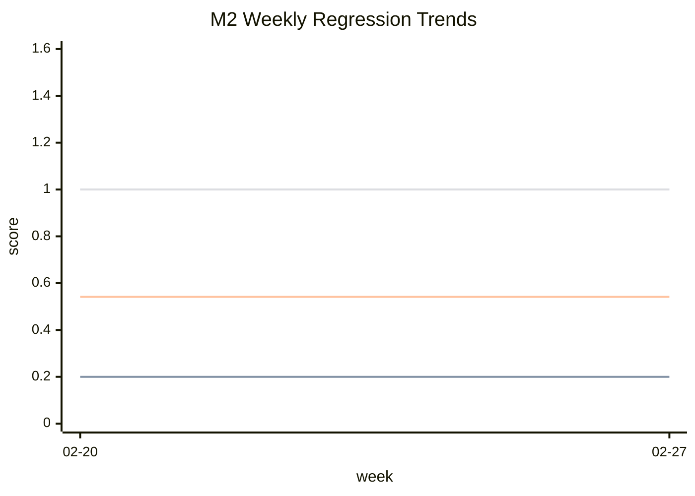

# M2 Weekly Regression Report

- generated_at: 2026-02-27T00:00:00.000Z
- schema_version: xhub.memory.weekly_regression_report.v1

## Baseline vs Current
| Metric | Baseline | Current | Delta |
|---|---:|---:|---:|
| precision@k(avg) | 0.2 | 0.2 | 0 |
| recall@k(avg) | 1 | 1 | 0 |
| p95 latency(ms) | 0.234 | 0.234 | 0 |
| adversarial match rate | 54.17% | 54.17% | 0 |

## Regression Checks
| Check | Status | Detail |
|---|---|---|
| recall | pass | delta=0.0000 (max drop=0.02) |
| precision | pass | delta=0.0000 (max drop=0.03) |
| p95_latency | pass | ratio=1.0000 (max ratio=1.5000) |
| adversarial_match | pass | delta=0.0000 (max drop=0.01) |

## Observability Alerts
- critical: 0
- warn: 1
- no_data: 7
- top_stage_anomaly: gate (score=66)

## Trend Chart

## Auto TODO
- [P0] gate3_security is failing in weekly snapshot (owner=security, stage=gate, source=gate_hint)
  - detail: Gate-3 requires prompt_bundle gate + secret_mode + credential deny + blocked consistency.
  - action: Prioritize security gate hardening and verify adversarial block behavior.

## Gate Snapshot
- gate1_correctness: pass
- gate2_performance: pass
- gate3_security: fail

