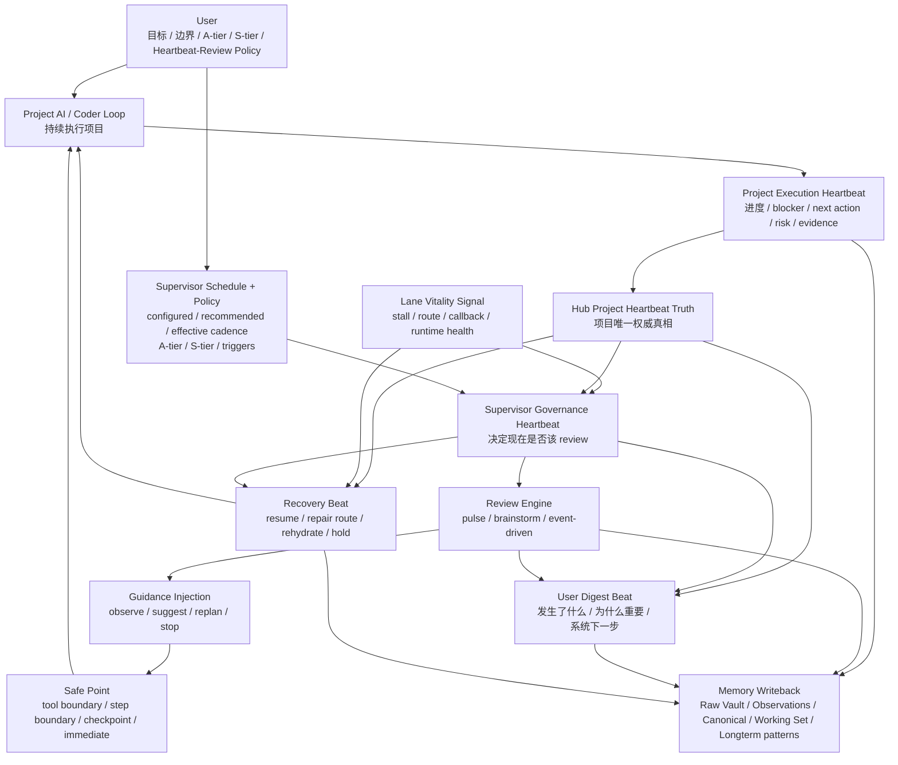
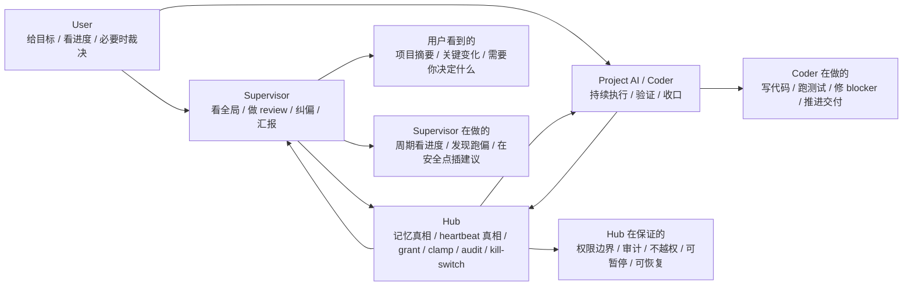
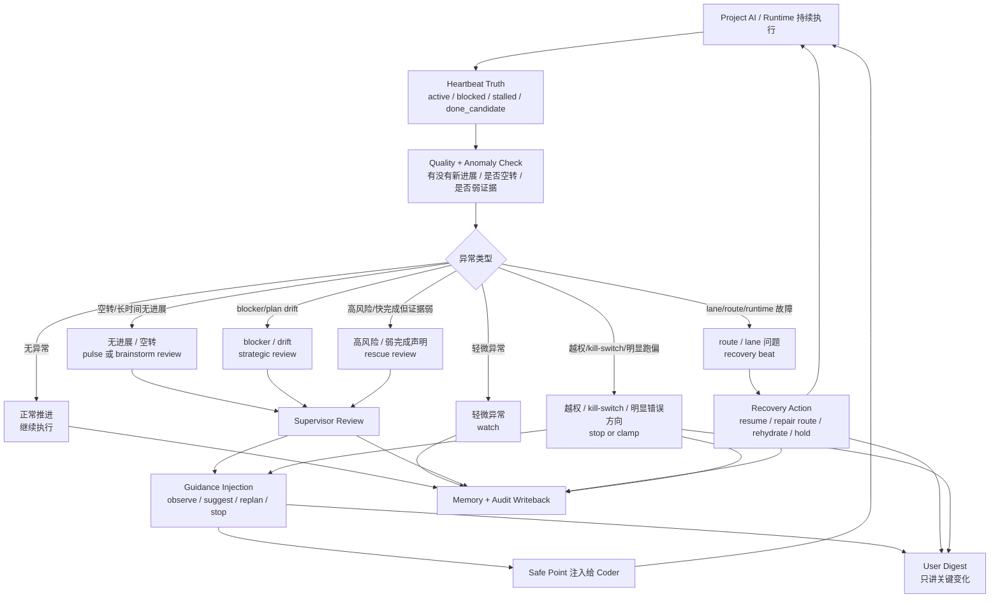

# X-Hub Heartbeat System Overview v1

- Status: Draft
- Updated: 2026-03-29
- Owner: Product / XT-L2 / Hub-L5 / Supervisor
- Purpose: 给后续 AI 和人一个 5 分钟读懂入口，先快速理解 X-Hub 最新 heartbeat 体系怎么分层、怎么配合、异常时怎么流转，再决定是否进入完整协议文档。
- Read this before:
  - `docs/memory-new/xhub-heartbeat-and-review-evolution-protocol-v1.md`
  - `docs/memory-new/xhub-project-autonomy-tier-and-supervisor-review-protocol-v1.md`
  - `x-terminal/Sources/Supervisor/SupervisorReviewPolicyEngine.swift`
  - `x-terminal/Sources/Supervisor/SupervisorReviewScheduleStore.swift`

## 1) 一句话总览

这套系统里不是“一个 heartbeat”。

而是四层协作：

- `Project Execution Heartbeat`
  - project coder / automation runtime 告诉系统“项目现在推进得怎么样”
- `Supervisor Governance Heartbeat`
  - Supervisor 判断“现在该不该 review、该看多深、要不要纠偏”
- `Lane Vitality Signal`
  - XT 内部看运行链路有没有 stall、freeze、route 抖动
- `User Digest Beat`
  - 最终给用户看的、人话版项目变化摘要

一句话记忆：

`Coder 负责做，Supervisor 负责盯，Hub 负责管，用户负责定目标和关键裁决。`

## 2) 四类 Heartbeat 各自做什么

### 2.1 `Project Execution Heartbeat`

它是项目执行真相，不是聊天文案。

它回答：

- 现在 active 还是 blocked
- queue 深度多少
- blocker 是什么
- next action 是什么
- 当前风险大不大
- 最近有没有真正进展

它的真相默认由 Hub 持有。

### 2.2 `Supervisor Governance Heartbeat`

它不是 project 自己发的心跳，而是 Supervisor 的治理节奏。

它回答：

- 现在该不该 review
- 这次是 pulse / brainstorm / event-driven
- 是 observe、suggest、replan，还是 stop
- 建议是不是需要 ack

### 2.3 `Lane Vitality Signal`

它不是项目业务进度，而是 XT 内部运行健康度。

它回答：

- lane 有没有卡住
- tool loop 有没有 freeze
- callback 有没有丢
- route 是否抖动
- runtime 是否 still healthy

### 2.4 `User Digest Beat`

它是用户可见投影，不是内部原始状态。

它只说三件事：

- 发生了什么变化
- 为什么这件事值得你知道
- 系统接下来准备怎么处理

它不该直接展示：

- `grant_pending`
- `lane=...`
- `event_loop_tick`
- 其它工程噪音

## 3) 图一：系统总图

怎么读：

- 左侧是执行环
- 中间是治理环
- 右侧是用户摘要和恢复
- 底部是记忆闭环

## 4) 图二：产品视角

怎么读：

- 用户不用盯每一步
- coder 负责推进
- supervisor 负责纠偏
- Hub 负责做最终治理底座

## 5) 图三：异常流转

怎么读：

- 不是所有异常都去打扰用户
- 轻的先观察
- 中等的起 review
- 能修的走 recovery
- 高风险或越权才 stop / clamp

## 6) 最短记忆版

如果只记这 7 句，就够了：

1. 系统里不是一个 heartbeat，而是四层。
2. `Project Execution Heartbeat` 是项目真相，不是聊天话术。
3. `Supervisor Governance Heartbeat` 决定什么时候该 review，不等于 project 自己发的 beat。
4. `Lane Vitality Signal` 负责看链路健康，不负责对用户讲项目进度。
5. `User Digest Beat` 只讲用户需要知道的变化，不讲工程噪音。
6. `heartbeat != review != intervention`，三者必须分开。
7. 默认在 safe point 注入 guidance，只有高风险、越权、kill-switch、明显错误方向才立即打断。

## 7) Next Read

如果要继续深入，按这个顺序读：

1. `docs/memory-new/xhub-heartbeat-and-review-evolution-protocol-v1.md`
2. `docs/memory-new/xhub-project-autonomy-tier-and-supervisor-review-protocol-v1.md`
3. `x-terminal/Sources/Supervisor/SupervisorReviewPolicyEngine.swift`
4. `x-terminal/Sources/Supervisor/SupervisorReviewScheduleStore.swift`
5. `x-terminal/Sources/Supervisor/SupervisorManager.swift`
